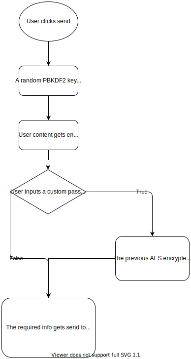

  

<h4 align="center">A Zero-Knowledge Encrypted Text/Code sharing project written in Crystal</h4>

   
    
    

## Features

- Client-Side encryption
- QRcode generation
- Custom Password on top of normal encryption
- Customizable UI
- Highlight.js for bins marked as code
- Delete Keys
- Burning after reading

## Screenshots

  
  
  

## Spec

BeardBin uses AES for the base encryption and RABBIT for the custom pass word one (on top of AES).

The decryption key (for the base encryption) is ON the url itself. While if it also has a custom password the user will be asked to input it on the ui.

Encryption and decryption happens on the client side.

The following info are being saved on the database:

- \_id: the id of the bin (a uuid)
- content: the encrypted content
- code: whether or not the bin is marked as `code`
- creation_date: the date the bin got created (for cleaning purposes mostly (like deleting all month-old bins))
- custom_password: whether or not the bin has a custom password
- view_once: whether or not the bin is marked as `view_once` (aka burn after reading)
- delete_id: the delete key (used for deleting the bin)
- iv: the iv used for the base encryption

## Flowchart

## Demo

There will be a heroku-hosted instance on the sidebar. Speed might be reduced to it.

## How to run

`$ crystal run src/beardbin.cr`

During dev you might need to change some frontend urls to match the backend's port.

The frontend uses vue cli.

After building frontend, place the generated files in `public/`.

Make sure to fill and rename `.env.example` to `.env`.

Made with [contributors-img](https://contrib.rocks).
